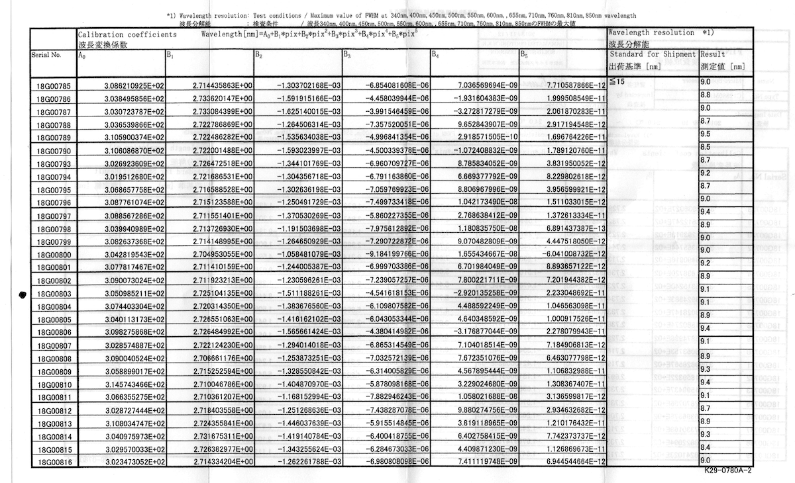
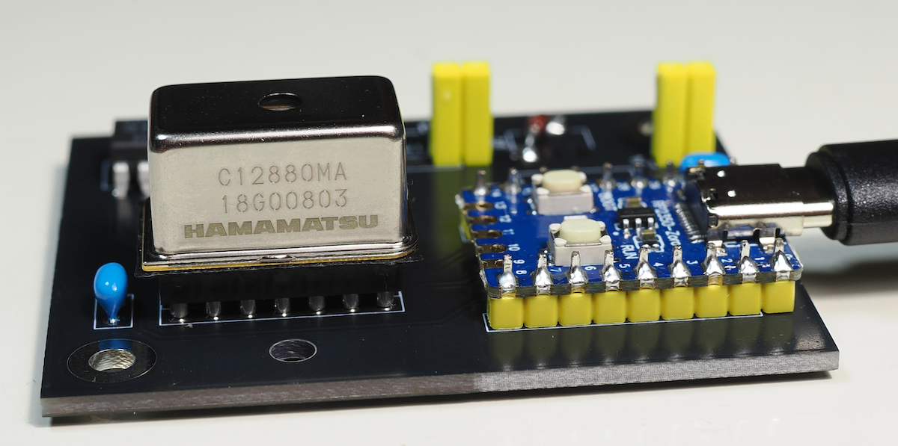

# EduSpectroLab
解析アプリケーション
[📖 総合ガイド（Webサイト）はこちら](https://eduspectro.github.io/)

*   **動作環境**: Processing 4.x で動作します。
*   **追加ライブラリのインストールは不要です。**
 
 
 

---
## 波長校正データ （重要）
分光センサーC12880MAには個々の波長校正データが添付されています。"system_config_do_not_delete"フォルダに入っている"calibration_coefficients.txt"をテキストエディタで開いてシリアル番号と6個の数値を書き換えてください。

**波長変換式**  
浜松ホトニクス製の分光センサ C12880MA では、以下の **5次多項式** を用いてピクセル番号（ $pix$ ）を波長（ $\lambda$ ）に変換します。

$$
\lambda = A_0 + B_1 \cdot pix + B_2 \cdot pix^2 + B_3 \cdot pix^3 + B_4 \cdot pix^4 + B_5 \cdot pix^5
$$

**各項の説明**　

* **$\lambda$ (nm)**: 算出される波長（ナノメートル）。
* **$pix$**: ピクセル番号（0 〜 287）。
* **$A_0, B_1, B_2, B_3, B_4, B_5$**: 各センサ個体に固有の **校正係数（Calibration coefficients）**。

**各係数の役割と意味**　 
この式は、センサ内部のCMOSイメージセンサ上の位置（ピクセル）と、実際に届く光の波長との非線形な関係を補正するものです。
* $A_0$: 切片に相当し、おおよそ 300 前後の値をとります。
* $B_1$: 1次係数であり、ピクセルあたりの波長の変化量（分散）を決定します。C12880MAでは 2.7 前後の値が一般的です。
* $B_2$ 〜 $B_5$: センサ内の光学系の歪みや回折格子の特性による非線形性を微調整するための高次項です。

 
 

**センサーに添付されている波長校正データの例**

 
 

**センサーのシリアル番号の刻印**

 
 

**calibration_coefficients.txtの例**　
* 1行目（シリアル番号）: 18G00803
* 2行目 ($A_0$): 305.0985211
* 3行目 ($B_1$): 2.725104135
* 4行目 ($B_2$): -0.001511188261
* 5行目 ($B_3$): -4.541618153E-6
* 6行目 ($B_4$): -2.920135258E-9
* 7行目 ($B_5$): 2.233048692E-11

**calibration_coefficients.txt作成のヒント**　 
校正データの数値は桁数が大きいため手入力をすると誤る可能性が高いです。スキャンやカメラで撮影した画像をAIに渡してデータを作成して、さらに誤りがないか確認することをお勧めします。
* **プロンプトの例**  
左端がシリアル番号です。18G00803のA0からB5までの数値を読み取ってください。シリアル番号と6個の数値を縦1行で表示してください。

---

 
 
 

*   **使い方**: 
    EduSpectro公式ガイドのEduSpectroLabの項を参照してください。
*   **カスタマイズのヒント**: お勧めは、AIにこのプログラムを読み込ませて、自分のカスタマイズしたい点を伝えて、動作を確認しながら作り込んでいくのが良いのではないかと思います。
